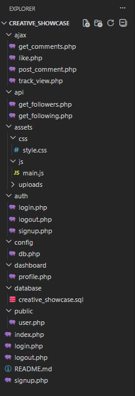
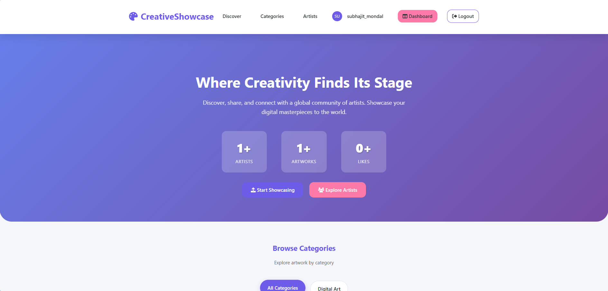
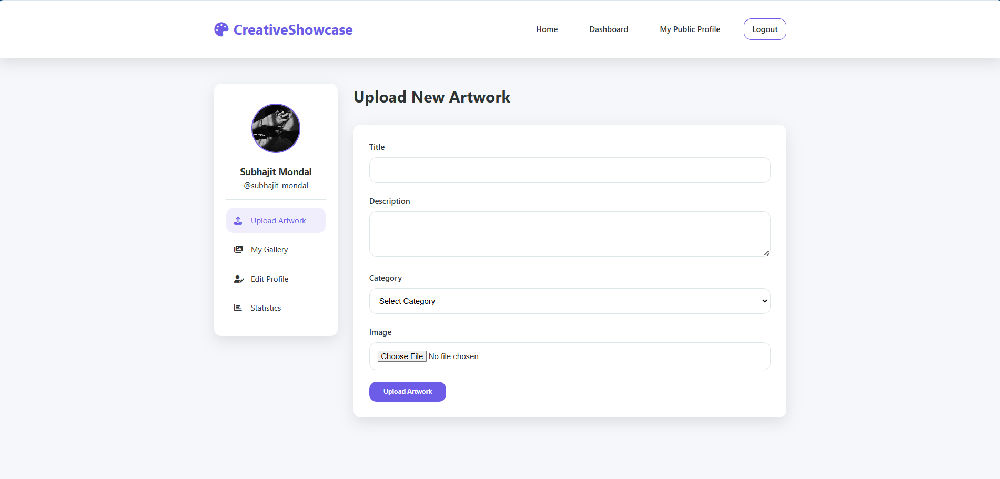
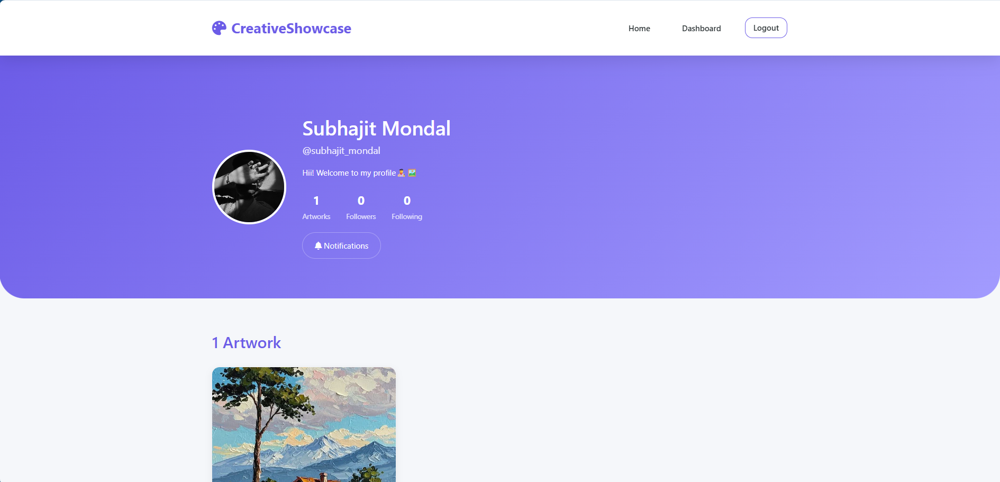

# 🎨 Creative Showcase

Creative Showcase is a **full-stack web application** that allows users to upload, showcase, like, comment on, and interact with creative artworks.  
It is built using **PHP, MySQL, HTML, CSS, JavaScript, and AJAX** with a responsive UI.

---

## 🚀 Features

- 🔐 User Authentication (Signup / Login / Logout)
- 🖼️ Upload and display artworks/images
- ❤️ Like posts without page reload (AJAX)
- 💬 Comment on posts dynamically
- 👁️ Track post views
- 👤 User profiles & dashboards
- 📱 Fully responsive design
- ⚡ Fast and interactive UI 

---

## 🛠️ Tech Stack

**Frontend**
- HTML5
- CSS3
- JavaScript

**Backend**
- PHP
- MySQL

**Server**
- Apache (XAMPP)

---

## 📁 Project Folder Structure



---
```
## ⚙️ Installation & Setup
1️⃣ Clone the Repository
git clone https://github.com/your-username/creative-showcase.git

2️⃣ Move to Server Directory
  - XAMPP: htdocs/

3️⃣ Import Database
  - Open phpMyAdmin
  - Create a database named:
                            creative_showcase
  - Import:
          database/creative_showcase.sql

4️⃣ Configure Database
  Edit config/db.php:
    $conn = mysqli_connect("localhost", "root", "", "creative_showcase");

5️⃣ Run the Project
  - Open in browser:
        http://localhost/creative_showcase/
```
---

## 📸 Screenshots
🏠 Home Page


👤 User Dashboard


🌍 Public Profile


---

## 🔒 Security Features
  - Password hashing
  - Session-based authentication
  - SQL injection prevention (recommended: prepared statements)
  - File upload validation

---

## 👨‍💻 Author
**Subhajit Mondal**

**📧 Email:** mondalsubhajit059@gmail.com

**🌐 GitHub:** https://github.com/mondal-subhajit05


